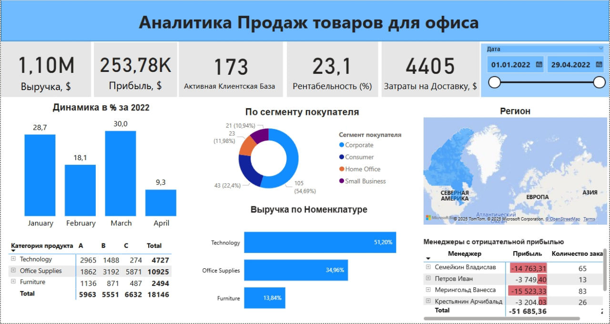
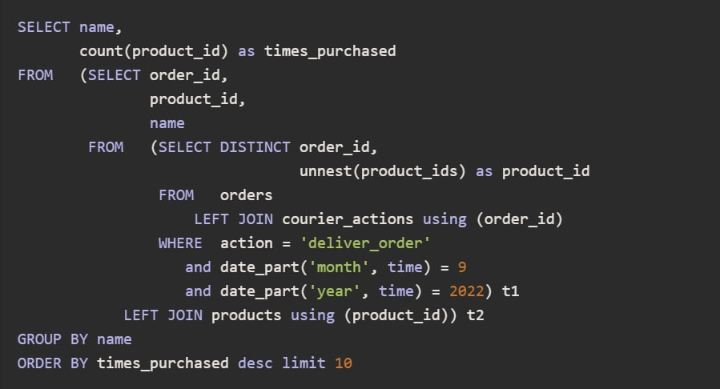
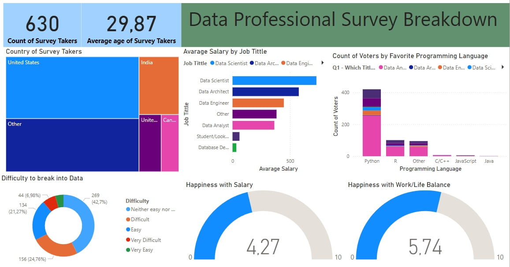

# PowerBI Project
<h1 align="center">Hi, My name is Nikolai!

</h1>
<h2 align="center">I am a Data Analyst.</h2>

<h2>This is my portfolio for data analytics projects:</h2>
<ol>
   <li>
      <h3>Аналитика Продаж товаров для офиса</h3>
      

      <strong>Power BI Dashboard:</strong> <a href="https://github.com/NikolaiB-ux/Power_BI_SQL_Query/blob/main/images/photo_2025-04-29_11-21-27.jpg">Аналитика Продаж товаров для офиса</a> 
      <strong>Описание:</strong> Разработка дашборда в Power BI на основе "сырых данных".Создание моделей данных.
       Создание вычисляемых столбцов. 
       Проведение подсчетов и создание карточек KPI с такими ключевыми метриками как Выручка, Прибыль, Рентабельность, АКБ, Затраты на логистику. 
       Визуализация динамики продаж по месяцам, по сегменту покупателя и категории товаров с дрилл-даун категория - субкатегория - номенклатура.
        Проведение подсчета рентабельности товаров в ABC анализе.
         Создание таблицы с менеджерами, которые продают с отрицательной прибылью и отображение количества таких заказов. 
      
      

   </li>
   <li>
      <h3>SQL Query</h3>
      

      <strong>SQL Join Query:</strong> <a href="https://github.com/NikolaiB-ux/Power_BI_Project/blob/main/images/SQL_Join_Query.jpg">SQL Join Query</a> 
      <strong>Description:</strong> My SQL Query is about creating a query by using Joins that can help to reveal top 10 popular goods delivered in September 2022  
      
      

   </li>
   <li>
      <h3>Data Professional Survey</h3>
      

      <strong>Power BI Dashboard:</strong> <a href="https://github.com/NikolaiB-ux/Power_BI_Project/blob/main/images/photo_2024-12-11_11-27-57.jpg">Data Professional Survey</a> 
      <strong>Description:</strong> My dashboard project is about a Professional Survey of such things as
the survey takers average age, their countries, jobs, difficulty for them to switch into Data, 
the programming language they prefer, happiness with their salary and with work/life balance and this survey is done with Power BI from scratch. 
      
      

   </li>
</ol>
<h2>Languages and Tools:</h2>

  
  
  
  
  
  

<h2>Contacts</h2>
<ul>
   <li>
      Telegram: <a href="https://t.me/Nikolay23B">Nikolai Bogdanov</a>
   </li>
   <li>
      E-mail: <a href="mailto:nikolaybogdanov953@gmail.com">Nikolai Bogdanov</a>
   </li>
</ul>